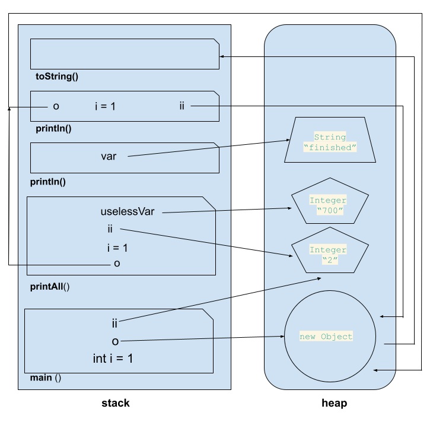

# Задача "Понимание JVM"

Загрузчик классов `ClassLoaders` сначала проверяет, не загружал ли он данный класс `JvmComprehension` ранее. Если нет, то загрузчик 
ищет класс самостоятельно на трех уровнях:

* `Application` (загрузка классов приложения из ClassPath), 
* `Platform` (выбранные модули Java SE,JDK),
* `Bootstrap`(основные модули Java SE,JDK).

Если класс найден происходит:
* Связываение (`linking`) на данном этапе происходит верификация(проверка байт кода), 
* Подготовка (`preparation`) -выделение памяти для статических переменных и инициализация памяти занчениями по умолчанию.
* Разрешение (`resolution`) - преоброзование символьных ссылок типов в прямые ссылки.
Инициализаия - вызов Java кода

Данные помещаются в специальную область памяти `MetaSpase`.


``` java
public class JvmComprehension {
    public static void main(String[] args) {
        int i = 1;                      // 1  в стеке cоздается фрейм main, в нем переменная "i" равная  "1";
        Object o = new Object();        // 2  создается переменная "о" - ссылка на объект new Object(создается в кучи);
        Integer ii = 2;                 // 3  создается переменная "ii" - ссылка на знаение объекта Integer равное "2"(объект класса создается в Heap);
        printAll(o, i, ii);             // 4  создается в стеке фрейм printAll, с переменными "о", "i", "ii";
        System.out.println("finished"); // 7  создается в стеке фрейм println, ссылка указывает на объект String 
                                        //    созданный в heap со значением "finished".
    }
// по завершениею метода main, все методы выводится из стека по принципу LIFO. Память heap очищается. 
    private static void printAll(Object o, int i, Integer ii) { //
        Integer uselessVar = 700;       // 5 создается ссылочная переменная "uselessVar" в фрейме printAll,
                                        // ссылка указывает на объект класса Integer созданный в heap со значением 700
        System.out.println(o.toString() + i + ii);  // 6 в стеке создаются фреймы println и toString. В фрейм println передаются переменные
                                        // "о" и "ii" которые хранят ссылки на Object и Integer, "i" со значением 1.           
    }
}
```

**структура памяти схематично**:
