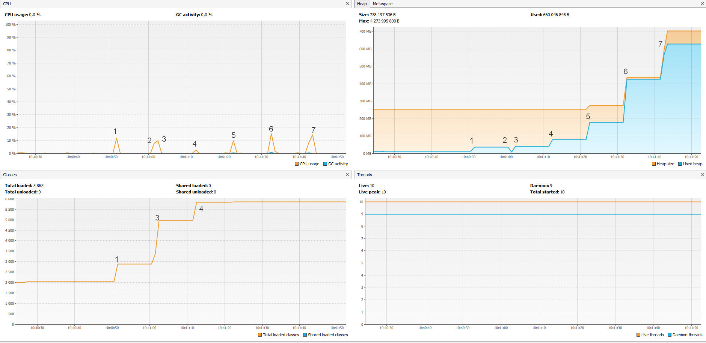

# Исследование JVM через VisualVM

Цель: Изучение использования памяти через VisualVM при загрузке новых классов и создании новых объектов.

[пример проекта здесь](https://github.com/Arsennikum/jvm-visualvm-experience)

**Метрики программы**:

1. Загрузка библиотеки  `io.vertex` загружено 529 классов из библиотеки, увеличение памяти в кучи, увеличение размера памяти в `Metaspase`.
1. Сработал сборщик мусора, освобождение памяти в кучи.
1. Загрузка библиотеки `io.netty` загружено 2117 классов из библиотеки, увеличение памяти в кучи, увеличение размера памяти в `Metaspase`.
1. Загрузка библиотеки `org.springframework` загружено 869 классов из библиотеки, увеличение памяти в кучи, увеличение размера памяти в `Metaspase`.
1. Загрузка 5_000_000 объектов, увеличение размера кучи.
1. Загрузка 5_000_000 объектов, увеличение размера кучи.
1. Загрузка 5_000_000 объектов, увеличение размера кучи.

* В пунктах 1,2,3 получение всех классов иерархии осуществляется методом `loadToMetaspaceAllFrom` которому в качестве аргумента предается название библиотеки.
Индексирование методанных и загрузка в JVM `ClassLoaders` происходит за счет рефлексии в момент непосредственно работы программы.
* В пунктах 5,6,7 создаются объекты класса `SimpleObject` которые добавляются в `ArrayList` количеством заданным пользователем в данном случае 5_000_000

Интервал между методами задается пользователем равным 10 секунд.